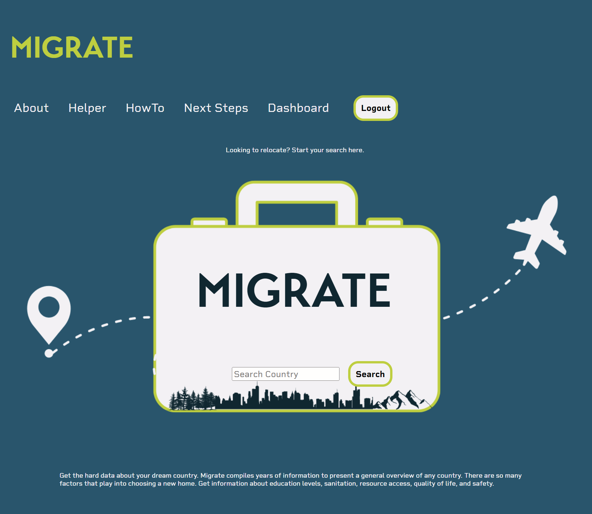
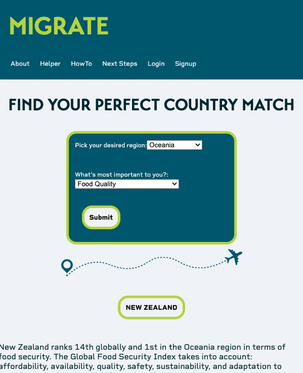
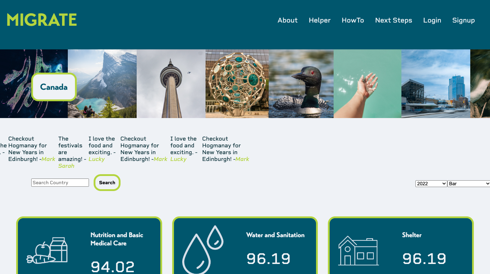
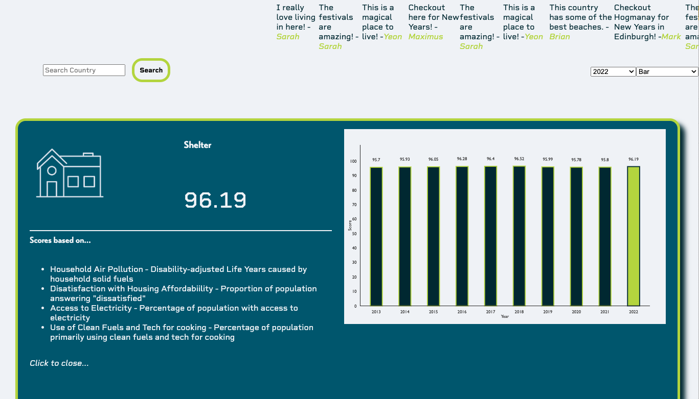
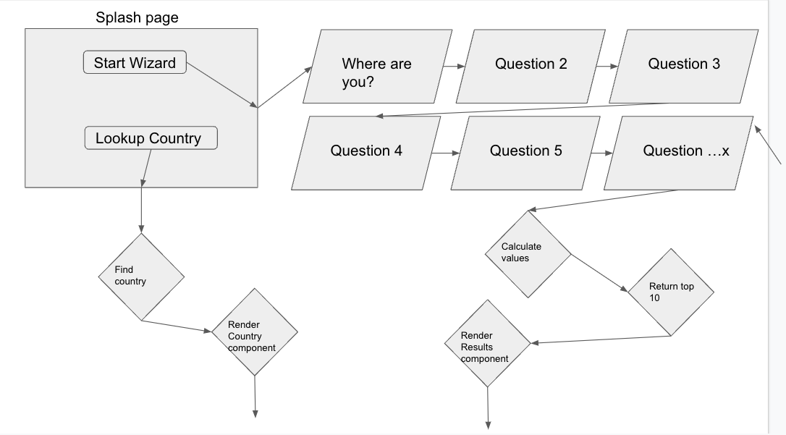
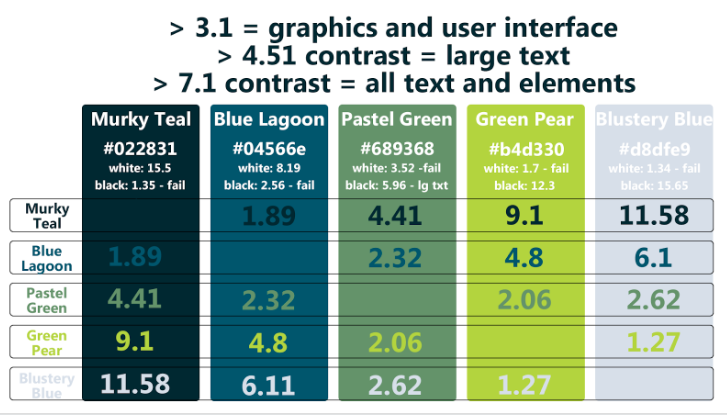
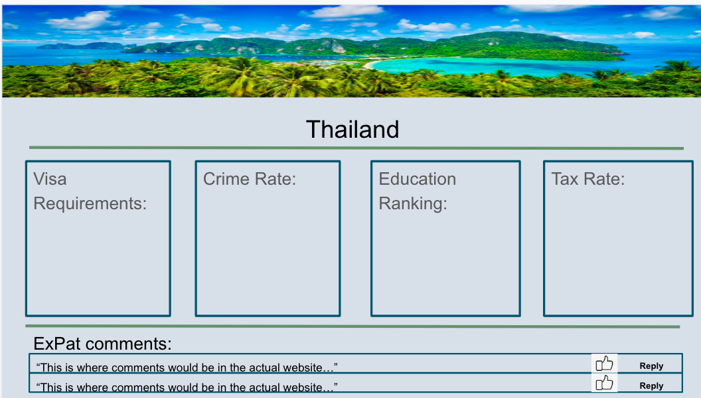
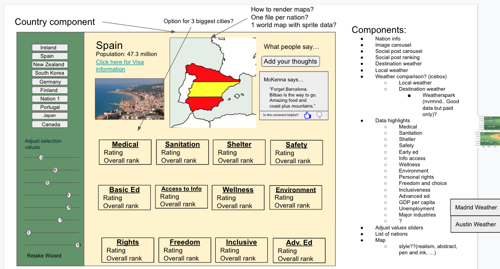

# Migrate

## Collaborators

Made with [contrib.rocks](https://contrib.rocks).

## Description

This app is designed to provide data on countries and their social performance so users can make informed decisions about where in the world to live. 

**Deployment Date:**  12/11/22  
 
**Deployed Site:** [https://migrate-abroad.herokuapp.com/](https://migrate-abroad.herokuapp.com/)  

  ## Table of Contents
- [Project Description](#Description)
- [Technologies](#Technologies)
- [Usage](#Usage)
- [Images](#Images)
- [Challenges Encounted](#Challenges)
- [Future Development](#Future-Development)
- [Resources/Links](#Resources/Links)
- [Credits](#Credits)
- [License](#License)
   
  

## Technologies
- [React](https://reactjs.org/)
- [Node.js](https://nodejs.org/en/)
- [Express.js](https://expressjs.com/)
- [MongoDB](https://www.mongodb.com/)
- [Mongoose](https://mongoosejs.com/)
- [GraphQL](https://graphql.org/)
- [Apollo Server](https://www.apollographql.com/docs/apollo-server/)
- [Heroku](https://www.heroku.com/)
- [JWT](https://jwt.io/)
- [Bcrypt](https://www.npmjs.com/package/bcrypt)
- [Victory Charts](https://formidable.com/open-source/victory/)
- [GreenSock](https://greensock.com/gsap/)
- [SASS](https://sass-lang.com/)
- [Canva](https://www.canva.com/)
- [MindMeister](https://www.mindmeister.com/)

 
## Usage 

To use this application, simply visit the [deployed site](https://migrate-abroad.herokuapp.com/).                

Start a search with a country in mind. Are you curious about the stats of a particular country? Type the name of the country into any search bar and hit search.
<ul>
<li>A new page will show up with tiles displaying a title of the component being measured, the country’s associated rating or ranking for that measurement and a relevant icon.</li>
<li>Clicking on the tile will populate more detailed country information and a graph with historical ratings for the measured component.</li>
<li>There are currently 12 tiles available per country which show how a country ranks on matters like Access to Basic Knowledge, Personal Safety, and Health and Wellness. Click them all or only the ones pertinent to you for a better understanding of the country you might one day call home.</li>
</ul>

Not set on a destination, yet? Use our [Helper](https://migrate-abroad.herokuapp.com/form) to pinpoint a destination.
<ul>
<li>Simply choose what’s most important to you and Migrate's Helper will suggest a country based on your selection. </li>
<li>Click on the country name to see more information about the country.</li>
</ul>

To deploy the application locally run ``npm run develop`` in the terminal from the ``root`` folder.

## Images

_
Deployed Landing Page
_
 

_
Deployed Helper Page
_
 

_
Deployed Country Page
_
 

_
Deployed Data Details
_
 

_
Process: Wireframe
_
 

_
Process: Style Guide 
_
 

_
Process: Mockup v1
_
 

_
Process: Mockup v2
_
 

## Challenges
Because we each took on specific components of the app to produce, an overarching challenge was understanding the functionality of other components and how they interacted with each other. 

Independently, we each had our own set of challenges within our own components. Integration of the search bar functionality and the ability to capture the results in separate places within the app required a great deal of collaborative troubleshooting. The functionality of the intake form involved many moving parts that eventually led to it being rewritten entirely. Victory charts were a new technology that required a great deal of research and experimentation to affect visual data presentation.

## Future Development

- Check results of image search to avoid duplicate images
- Add a "compare" feature to compare countries
- Refactor Helper component to use mapping 
- Transparent and equal-sized icons
- Add user location, weather comparison and currency conversion
- Add images to login page
- Add RFS component and redeclare font sizes for responsiveness

## License

Click the badge to learn more about the license used for this project.

## Questions?

If you have any questions about the repo, open an issue or contact any of the collaborators through github (linked above).

## Credits

None of our work would have been possible without the invaluable data resources provided by [Social Progress Imperative](https://www.socialprogress.org/).

## Resources/Links 

[How to create a React Dropdown](https://www.robinwieruch.de/react-dropdown/)
[How to Create Google Geo or Region Chart in React Js](https://www.positronx.io/how-to-create-google-geo-or-region-chart-in-react-js/)

