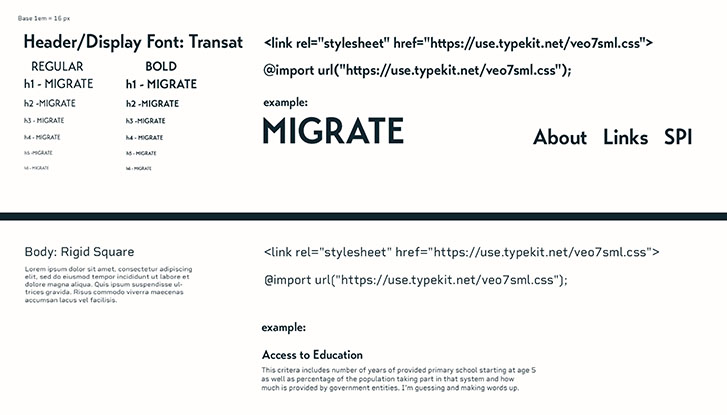

# Migrate

A full-stack application that helps to visualize data about countries around the world.

## Collaborators

Made with [contrib.rocks](https://contrib.rocks).

## Description

With the growing acceptance of remote work, many people are reconsidering where they want to make their home. For some people this means a potential move overseas. This app is designed to help people looking for a new home by providing data on countries and their social performance so users can make informed decisions about where in the world to live. 

**Original Deployment Date:**  12/11/22  
 
**Deployed Site:** [https://migrate-abroad.herokuapp.com/](https://migrate-abroad.herokuapp.com/)  

  ## Table of Contents
- [Project Description](#Description)
- [Technologies](#Technologies)
- [Usage](#Usage)
- [Development](#Development)
- [Challenges Encounted](#Challenges)
- [Future Development](#Future-Development)
- [Resources/Links](#Resources/Links)
- [Credits](#Credits)
- [License](#License)
   
  

## Technologies
- [React](https://reactjs.org/)
- [Node.js](https://nodejs.org/en/)
- [Express.js](https://expressjs.com/)
- [MongoDB](https://www.mongodb.com/)
- [Mongoose](https://mongoosejs.com/)
- [GraphQL](https://graphql.org/)
- [Apollo Server](https://www.apollographql.com/docs/apollo-server/)
- [Heroku](https://www.heroku.com/)
- [JWT](https://jwt.io/)
- [Bcrypt](https://www.npmjs.com/package/bcrypt)
- [Victory Charts](https://formidable.com/open-source/victory/)
- [GreenSock](https://greensock.com/gsap/)
- [SASS](https://sass-lang.com/)
- [Canva](https://www.canva.com/)
- [MindMeister](https://www.mindmeister.com/)

 
## Usage 

To use this application, visit the [deployed site](https://migrate-abroad.herokuapp.com/). 

_
Deployed Landing Page
_               

Once you're there, you'll have several options to explore.
- You can type in a country and click on search.
- You can open the interactive map to see a global overview of countries and click on the one you want to see details fo.
- You can use the Helper to make a quick choice about regions and your most important criteria.
- You can use the Wizard to adjust sliders and give different priorities different weights which will re-sort the nations based on your criteria.

Regardless of which option you choose, you'll eventually be taken to a page that shows information about that country. 

_
Deployed Country Page
_
There are 12 tiles showing the broad categories used to rank each country. You can see their base score in that category. If you click on one of the tiles, it will expand and give you more details about that category as well as charts showing their score in that category over time.

_
Deployed Data Details
_
You also have the option to compare country rankings from this page. 

**NOTE: This option is only available with the Line Graph data type**

To compare two countries, click on the compare toggle switch and search for a country in the new search field that appears. Once you search for a country you will see that nation's scores on the expanded graphs.

To deploy the application locally run ``npm run develop`` in the terminal from the ``root`` folder.

## Development

This project began as a final project for the Full-Stack Bootcamp at the University of Texas. After brainstorming possible projects, our group decided to pursue Migrate. We found data from the Social Progress Index that could be used in the application. We were able to download our own local copy of the data used by the Social Progress Index (with a donation to the organization) and import it into a new MongoDB instance.

Once we decided on the project, we began wireframing ideas on how the site should work.

_
Process: Mockup v2
_

_
Process: Mockup v1
_

With multiple versions available, we made decisions on what features would be most valuable as well as what could be completed in our one week timeframe for the camp. We finally settled in on a combination of the two main wireframes to get the layout of the page.

At this point the team split into backend and frontend development teams. While everyone worked on both sides at some point, we found it best to really focus on our personal strengths for this project.

- Backend team
  - Richard
  - Yeon
  - Sarah
- Frontend team
  - Mark
  - Paris

The overall flow of user experience was laid out first.

_
Process: Wireframe
_

While some aspects of our original flow was ultimately deemed too ambitious for our timeline, the initial chart helped develop the schema for our database as well as the structure of the site.

As the backend team starting building out the basic server functions, the front end team worked on developing branding and color stories. We used Canva to lay out some basic ideas for logos and art. We also used Material Design concepts from Google to choose colors and interaction states. We also talked about front end frameworks like Bootstrap or Material UI. It was suggested that instead of using a framework, we code the entire site with vanilla CSS. In the end we agreed to that plan and started building out expansive CSS with some help from SCSS in order to get all the functionality we needed.

_
Process: Style Guide 
_

_
Process: Font options 
_

Once the overall structure of the site was settled on, each team came together daily to implement new features, including the data visualization from Victory Charts, and pair program to overcome blocks and refine the end product.

## Challenges
Because we each took on specific sections of the app to produce, an overall challenge was understanding the functionality of other components and how they interacted with each other. For example, with the frontend team focused on building reusable components and responsiveness, it would take time to understand the database and server structure when and if and problem arose. This challenge ultimately led to us all trusting each other to do the best work and accept the abstract nature of developing a huge app with a team.

Independently, we each had our own set of challenges within our own components. 
- Integration of the search bar functionality and the ability to capture the results in separate places within the app required a great deal of collaborative troubleshooting.
- The functionality of the helper form eventually had to be rewritten entirely. 
- Victory charts were a new technology that required a great deal of research and experimentation to affect visual data presentation.
- Coding such a complex site in vanilla CSS turned out to be challenging, not just from a UI/UX perspective, but in also coordinating across mutliple developers who were working on building components to support their responsibilities.

## Future Development

- Check results of image search to avoid duplicate images
- Add user location, weather comparison and currency conversion
- Add images to login page
- Make all fonts responsive.

## License

Click the badge to learn more about the license used for this project.

## Questions?

If you have any questions about the repo, open an issue or contact any of the collaborators through github (linked above).

## Credits

None of our work would have been possible without the invaluable data resources provided by [Social Progress Imperative](https://www.socialprogress.org/).

## Resources/Links 

[How to create a React Dropdown](https://www.robinwieruch.de/react-dropdown/)
[How to Create Google Geo or Region Chart in React Js](https://www.positronx.io/how-to-create-google-geo-or-region-chart-in-react-js/)

